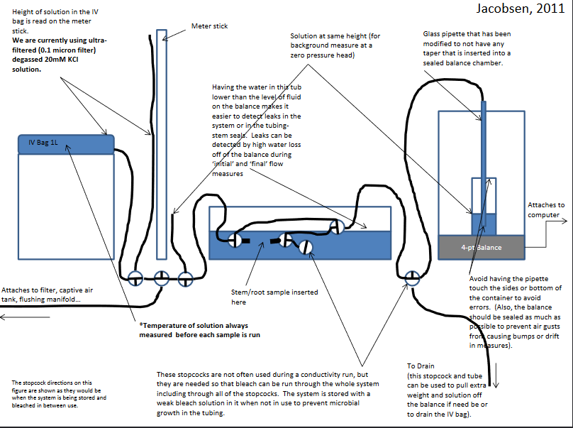
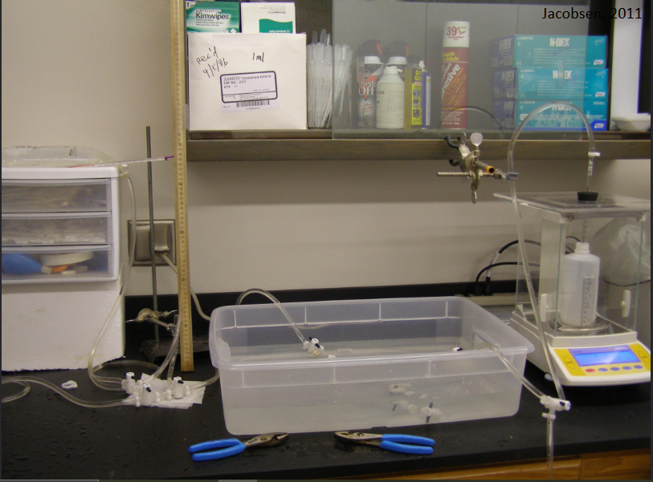
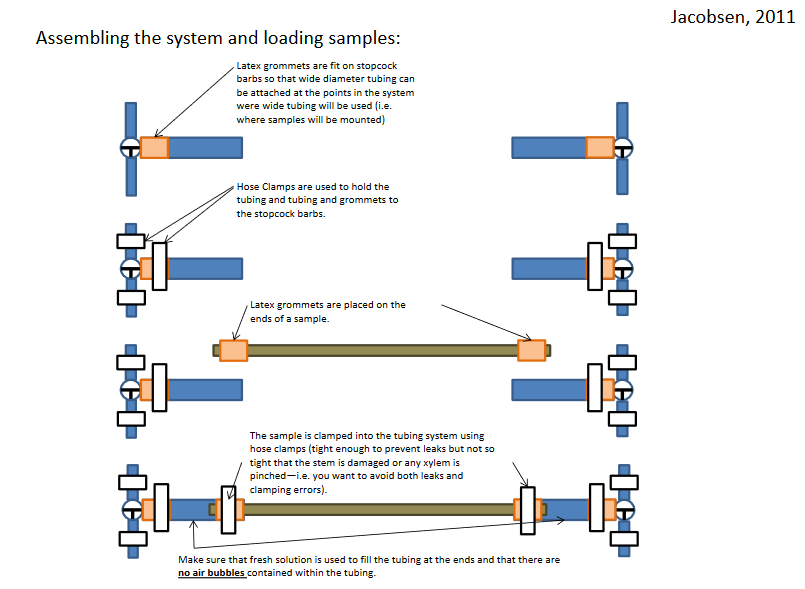
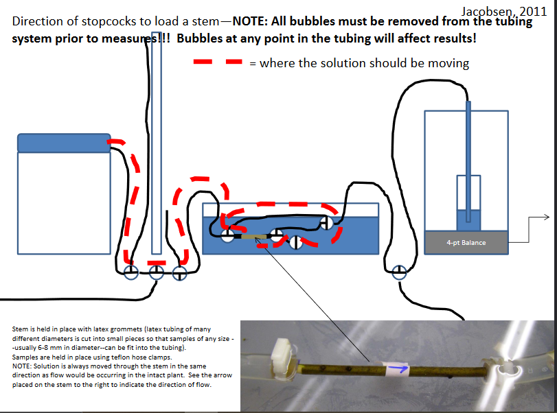
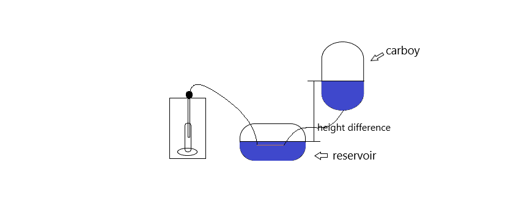
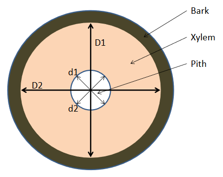

---
hide:
  - footer
---

# Hydraulic Conductivity Protocol

### Video of Method
A video of the method is available [here](https://drive.google.com/file/d/1rZ-i3XNrNKIRl-zMUvzXD_JPDPeWlYdb/view?usp=sharing) created for FES 561 at Oregon State University.
##### Additional Information
Video also shows Method to measure water potential with a pressure bomb

### Materials
- Rubber stopper for scale
- Scale that measures to the 4th decimal
- Carboy
- Small plastic bin to store submerged stems
- Graduated cylinder
- Meter stick
- Glass pipette
- Tygon 3601 tubing (1/4 in ID, 1/16 in wall) 
    - this composes the majority of the tubing in the system
- Tygon 3603 tubing (1/2 in ID, 1/8 in wall) 
    - this composes the wider tubing that samples are loaded into with the aid of latex tubing grommets
- Nalgene Three-way stopcock 
    - PP/TFE 6470-0004 4mm size
- Nalgene Two-way stopcock 
    - PP/TFE 6460-0004 4mm size
- Hose clamps:
    - For narrow diameter tubing: Cole-Parmer Snp-4 hose clamp (06832-04)
    - For wider diameter tubing (areas of the system where samples are loaded):       
        - Cole-Parmer Snp-12 hose clamp (06832-12)
- Plastic tubing connectors 5-1 Connectors (58018) 
    – these are used in the system to connect the places in the conductivity and flushing manifolds where samples are usually loaded. When the system is being bleached, these connectors close the openings and allow for all of the tubing and
connections to be bleached.
- In-line filter Calyx Capsule Nylon, 0.1 micron, 3/8 in barb, DCN010006

##### Notes
- Some miscellaneous sizes of latex tubing may be needed to make grommets that will fit a wide range of sample diameters.
- Extra hose clamp sizes are probably needed in some parts of the system (i.e. connected to the captive air tank and the filter)
    — there are sets
available that contain a few pieces of each of many different sizes.

### Apparatus

Figures 1 & 2: Set up for hydraulics conductivity by Jacobsen 2011. Our lab uses a carboy instead of an IV bag.

### Stem preparation
##### Collection
1. Cut branch from tree.
    1. Cut more than what you need as you will need to recut multiple times under DI water
    
2. Recut branch immediately under DI water. 
    1. Keep cut end of branch in DI water until ready to bring back to lab.

3. When back to lab for measurements, recut branch in DI water.
    1. Cut both ends in DI water with a razor blade. Cut all of your individual stems to 10 cms in length. Ensure these are clean cuts. The stem should always be completely submerged in water to ensure no air penetration in stem.

4. Cut each leaf off stem under DI water then remove.

5. Dab glue mixture at each leaf cut

6. Once both ends are cut keep stem leveled and don’t move it around too much while keeping it submerged in water.

##### Assembly
1. While the stem is submerged in DI water, attach the latex tubing grommets at the ends of the stem.

2. Please refer to figures 3 and 4 for complete assembly set up.
    1. Carboy is used instead of IV bag. Carboy is placed on shelf containing DI water at a vertical distance of 1 meter from graduated cylinder water.

3. Allow stems to soak overnight in DI water to allow saturation of stem.

Figures 3 & 4: Assembly images taken from Jacobsen 2011. Figure 3 shows stopcock and tubing assembly with the stem. Figure 4 shows full assembly for the whole system including direction of flow.

###### Important Notes
- To ensure there is no leaking, inject DI water into the tubing attached to the stem. The DI water should form a miniscus and remain at the same level. Test for leaking at both connections of stem.
- It is important to ensure no air enters into the stem. When connecting stem tubing apparatus to main tubing apparatus, inject DI water into the system to avoid any air bubbles.

##### Measurements
1. Download and open excel spreadsheet [conduct.ver1](https://docs.google.com/spreadsheets/d/19Gr1bHsw4f4eCfuZ9XkLv3EeIw5RaviX/edit?usp=sharing&ouid=117278050553426340443&rtpof=true&sd=true).
    1. Pressure difference in the stem is determined by the vertical distance of the water levels in the carboy and the balance.
        1. Record the height different of the water in the carboy to the height of the water in the reservoir prior to starting measurements. This is important in calculating pressure difference (see figure 5).
            1. $$Pressure\;difference = Height\;difference * Water\;Density * Gravitational\;Acceleration\;constant = \Delta hD_{water}g$$
    2. Excel program should be measuring weight every 5 seconds. Choose "target interval" for 5 seconds.

2. Refer to [Sartorius Balance COM Port Settings For Hydraulic Conductivity Protocol](https://cavender-bares-lab.github.io/Data-management-lab/protocols/sartorius_balance/) to connect computer and balance.

3. When ready for measurements, open stopcock to allow gravimetric water flow through the stem.
    1. Measurements should continue after steady-state flow for total of 10-15 minutes. It takes approximately 5-10 minutes to steady-state flow.
        1. Take initial series of measurements of stem at its current state i.e. with existing embolism at stem cutting.
        2. For the initial series of measurements, keep pressure below 2 KPa to keep emboli from getting flushed out.
        3. After these measurements, attach stem tubing apparatus to a vacuum chamber for 45 minutes at 50-60 KPa. This will get rid of embolism in the stems and these measurements give maximum hydraulic conductivity.

###### Important Notes
- Periodically flush the system with 1:3 bleach solution to prevent algal and bacterial growth.

### Calculations
$K_h=q(dp/dx)^{-1}=m^4\;MPa^{-1}s^{-1}$  
$K_s=K_h/Xylem\;area=kg\;m\;MPa{-1}s^{-1}$  
$Xylem\;area=[(D1/2)*(D2/2)*\pi]-[(d1/2)*(d2/2)*\pi]=m^2$  

##### Cross Sectional Xylem Area

### References
1. [Sperry J.S., Donnelly J.R. & Tyree M.T. (1988). A method for measuring hydraulic conductivity and embolism in xylem. Plant, Cell and Environment 11, 35–40.](https://drive.google.com/file/d/1tcAk82yoyZl9k7dgrSaOwtJAlEKsZrDk/view?usp=sharing)

2. [Cavender-Bares, Jeannine and Holbrook, N. M. (2001). "Hydraulic properties and freezing-induced cavitation in sympatric evergreen and deciduous oaks with contrasting habitats." Plant, Cell and Environment. 24:1243–1256.](https://drive.google.com/file/d/1bs9aqN0OU3xaAKGFa_EsYGql4ehvyVWg/view?usp=sharing)

3. [Jacobsen. (2011). (Measuring the hydraulic conductivity of plant samples](https://www.csub.edu/~ajacobsen/Conductivity%20Methods_2014.pdf)
