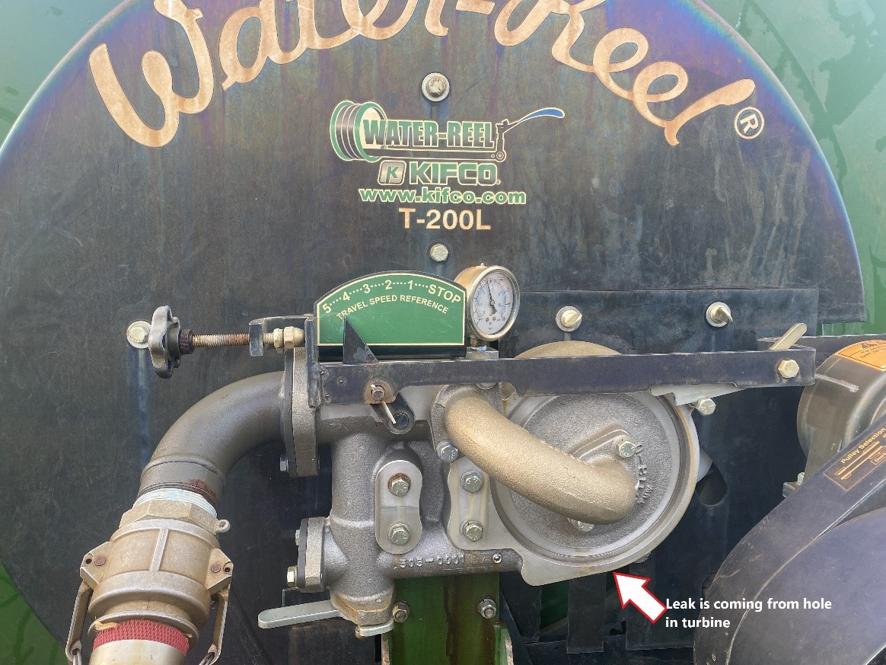
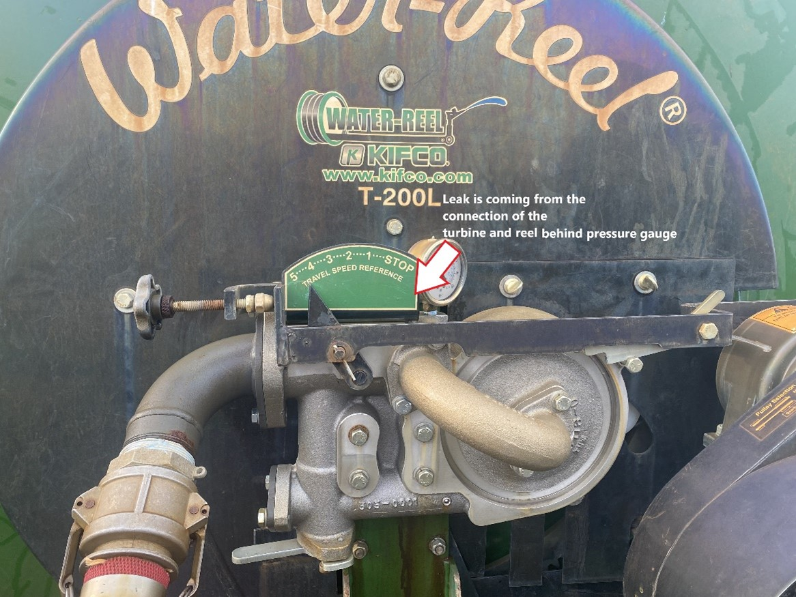
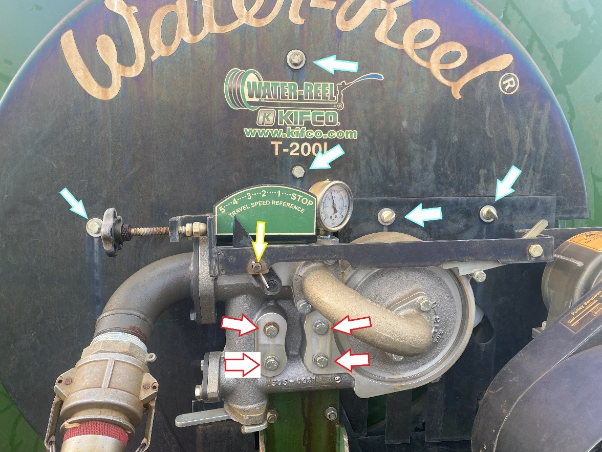

# Kifco Irrigation Protocol

### Objective
Detail steps to use, maintain, and repair Kifco T200L Water Reels.

### Setup and Irrigation
##### Moving reels
1. Disconnect the red hose.
    * Make sure the cap on the pipe is closed tightly before disconnecting.
2. Legs up.
    * Disengage and pull gun cart if wheels are blocking it.
    * Reel in gun cart after and re-engage the reel.
3. Pull up gun cart.
4. Confirm that the reel is engaged.
5. Hitch the gator to the irrigation reel (“tongue” assembly).

##### Pulling the hose out
1. Make sure the reel is in line/straight with the path in which you will pull out the hose.
2. Disengage.
3. Let down the legs. Pull the hose out if wheels are blocking it.
4. Attach the red hose to the pipe and reel. Open the pipe to get water to flow.
5. Hitch the chain of the gun cart to the gator. Make sure there are no kinks in the chain.
6. Pull the hose out with gator slowly. Make sure to pull it out as straight as possible (although this is not possible with certain blocks (South side of blocks 3 and 4). For these blocks, make sure that the hose does not hit the poles and trees/vegetation. If it does or is too close, move the hose to avoid getting stuck.
7. Push forward the pin/button on the gun cart.
8. Make sure the gun is in the correct direction.
9. Make sure the hose on the reel is wound tightly. If not already, disengage and wind up the hose to get it tight.  If not tight, hose might get tangled and get stuck during the run.

##### Turn on water
1. Open the water valve to FAB2.
2. Make sure all other valves are closed tight.
3. If breaker is off, turn on.
4. Turn well on to “hand”.
5. You can immediately move it to speed of 10.
6. Move up to 20, 40, and 60 every one minute.
7. Make sure reel is engaged and unhook the lever to pull in the hose. Speed should already be set. Make sure reel is moving and there are no major leaks. If there are, turn off water and investigate the issue (tips below).

##### Turn off water
1. Turn down speed.
2. Wait for pressure to get to ~25 (look at pressure gauge near well).
3. Turn off well.
4. Leave breaker on to let fan cool down computer.
5. Close water valve.

### Notes
* Always drive slowly and as straight as possible (not feasible with the south ends of blocks 3 and 4).
* Never move the reels in reverse
* Look behind you often to make sure the water reel/hose was set up properly
* Do not pull the hose too far. Otherwise it will break off from the reel. Stop at the flag. 
* Remove any trees, branches or brush that could potentially damage the hose. Its path should be clear.
* Do not drive over the hose.
* Important reminders
    * Block 1
        * There are flags on the north and south side to indicate where to stop when pulling out the gun cart.
    *	Block 2 
        * North road 
            * To ensure the hose doesn’t get pulled too far, place the water reel as far as you can from the irrigation line but also keep in mind the length of the red hose and to ensure you still give it some slack.
            * Drive in low gear and 4-wheel drive. Do not stop when going up the hill. If you are having issues while pulling it up, stop. Do not go further. Unhook the chain and start the reel where it stopped. 
            *	There is a flag to indicate where to stop when pulling out the gun cart. 
            *	When the water is turned on, make sure the whole end of the plots is getting watered and allow it to water for 10 minutes before turning on the speed.
        *	South road
            *	The gun cart can be pulled to the end of the plots.
    *	Block 3: There are flags on the north and south side to indicate where to stop when pulling out the gun cart.
        * South road
            * After pulling out the gun cart, move the hose to ensure there aren’t any obstacles.
    *	Block 4
        *	The gun cart can be pulled to the ends of the plots for both the north and south roads.
        *	South road needs to pulled at an angle.
*	Orings and pulley bands are stored in the third drawer in the FAB office.
    *	GRAINGER, O-ring, Dash 115, Neoprene, 0.1 In., Pk100, Item # 1BUV5
    *	Pulley band, Kifco, 51301090, Round belt 32.0” reinforced

### Leaks
* Leak 1: See picture below for location. This leak is difficult to fix on your own. This repair will be sent to Brian Malott from Kifco.

 
 
* Leak 2: Leak is coming from the connection of the turbine and reel. This can be found behind the pressure gauge. The oring at the connection is likely worn out and can be replaced easily.

* Both leaks require removal of turbine. Please refer to picture below for removal of bolts. Bolts with red lined arrow have a nut securing it. You’ll need a wrench to secure the nut. A ratchet wrench is ideal/most efficient to remove the bolts. Bolts with light blue lined arrow can be removed with a ratchet wrench only. Yellow lined arrow means you’ll need to pull out the pin to detach the speed adjuster from the turbine.

 
### Pulley replacement
* If the gun cart and water reel are not moving, it’s likely that there is too much wear on the pulley band to work properly. To confirm this is the issue, make sure the speed is turned on and view the pulley system behind the black cover. The band and the wheel attached to the motor need to move consistently for this to work properly.
    * If the pulley band is not the issue, 
* If the band looks loose or it is not moving the chain links connected to the motor, then the pulley band needs to be replaced. 
* In order to replace the band for the pulley system, you must remove the bolts (orange lined arrows—see picture below) and remove the small covering. 
* If you’re having difficulties getting access through that opening, you may take off the whole cover. You will need to remove the bolts with the green lined arrows. The motor has a picture of the placement of the pulley for fast and slow moving. 
* Putting on the band can be very difficult. It’ll be tight and you’ll need a good amount of strength to get the band locked into the wheels.