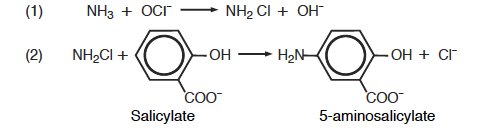
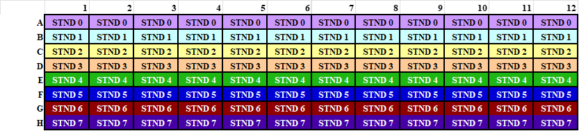
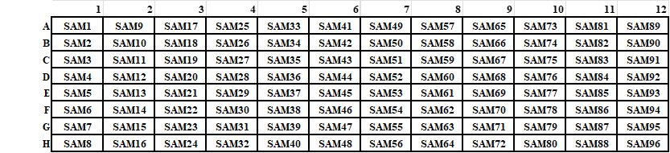
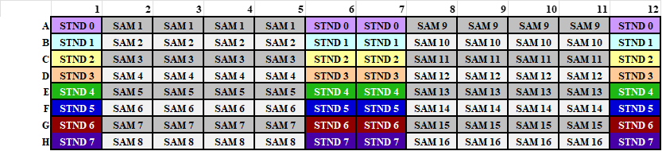

---
toc:
 - footer
---

###### Author

Hobbie Lab; Updated: 4 July 2013 by Charlotte Riggs

### Goal

This method is designed to measure ammonium and nitrate simultaneously, although either analyte can be assayed separately. Method is typically used for net mineralization.

### Templates

* [Standard Dilution Calculations](https://docs.google.com/spreadsheets/d/1iAhTc6yfGP4NOyHZBwg6olfzSxbEJ3V0/edit?usp=sharing&ouid=117278050553426340443&rtpof=true&sd=true){:target="\_blank"}
* [Plate & Data Map](https://docs.google.com/spreadsheets/d/15bw0N057uAWzRiqyxEypsEp4PrXslM98/edit?usp=sharing&ouid=117278050553426340443&rtpof=true&sd=true){:target="\_blank"}
* [Net Mineralization Calculations](https://docs.google.com/spreadsheets/d/1Bkc0xHEn6rYHDcQlWRBLX0OuHyorQIEc/edit?usp=sharing&ouid=117278050553426340443&rtpof=true&sd=true){:target="\_blank"}

### Ammonium Analysis

The Salicylate Method is a variation of the well-known Phenate Method, but it has an advantage of being free from mercury salts and phenol. This method is most useful for low range ammonia nitrogen determinations. Ammonia compounds are initially combined with hypochlorite to formmonochloramine (1), which then reacts with salicylate to form 5-aminosalicylate (2).

  
Oxidation of 5-aminosalicylate is carried out in the presence of a catalyst, nitroprusside or Fe(CN)5NO2– (also called nitroferricyanide), which results in the formation of indosalicylate, a blue-colored compound. The blue color is masked by the yellow color (from excess nitroprusside) causing a green-colored solution. The intensity of the color is directly proportional to the ammonia concentration in the sample.

### Nitrate + Nitrite Analyses

Adapted from: Doane TA, Horwath WR (2003) Spectrophotometric
determination of nitrate with a single reagent. Analytical Letters 36:2713-2722.

Vanadium (III) in dilute acid solution reduces nitrate
(NO3-) to nitrite (NO2-) and/or nitric oxide, both of which react with the sulfanilamide and N-(1-naphthyl)-ethylenediamine to produce color with an absorbance peak at 540 nm.

  

### Reagents
#### Ammonium Reagents

- Sodium Salicylate solution  
    - *In a 100 ml volumetric flask add:*
        - 6.8 g sodium salicylate (stored in analytical room)
        - 5.0 g sodium citrate (stored in analytical room)
        - 5.0 g sodium tartrate dibasic dehydrate (stored in analytical room)
        - 25 mg Sodium nitroprusside (stored in desiccator in analytical
        room, weigh out on microbalance)  
            - *Bring to volume with nanopure water.*  
            - Store in refrigerator, lasts a week.  
            - Note: Make 100ml for every 192 samples.
- NaOH Solution  
    - *In a 1000 ml volumetric flask add:*
        - 60 g sodium hydroxide (stored in analytical room)
            - *Bring to volume with nanopure water.*  
            - Store in plastic.
- Bleach Solution  
    - *Make fresh each day*
        - *In a 100 ml volumetric flask add:*
            - 2 ml of household bleach  
            - *Bring to volume with NaOH Solution.*  
            - Note: Make 100 ml for every 192 samples.

#### Nitrate Reagents

- 1M HCl  
    - *Per 1000 mL*
       - 82.5 ml concentrated HCl (*12.1N – stored in acids cabinet*) in 1000 mL water. **REMEMBER TO ALWAYS ADD ACID TO WATER**  
       - Store in plastic.

- Vanadium Reagent Solution  
    - Make concentrated (150 ml total volume) for low ppm NO3- samples or dilute (300 ml total volume) for high ppm NO3 samples.  
    - *To a dark plastic reagent bottle add:*
        - 100 ml of 1M HCl
        - 200 mg of sulfanilamide (stored in analytical room)
        - 100 mg of N-(1-naphthyl)-ethylenediamine dihydrochloride (stored in desiccator in analytical room)

    - *In a separate 50 ml glass beaker add:*
        - 50 ml 1M HCl
        - 400 mg of vanadium (III) chloride (stored in desiccator in analytical room)  
        - **CAUTION: Work quickly because Cl3V powder will react with air!**  
        - **Wear protective face mask and follow standard lab safety (wear glasses, gloves, lab coat) when preparing vanadium chloride.**

        - Mix vanadium chloride and HCl by swirling in the beaker and transfer to 60 ml syringe outfitted with a 0.45μ filter. Add vanadium chloride solution to the reagents in the dark plastic bottle by pushing vanadium chloride solution through the syringe. 
        - If making the dilute solution (for high ppm NO3 samples), add 150 ml of nanopure water. Note if low ppm samples (<2ppm NO3-), you can leave this water out to get more color development.  
        - Purge with nitrogen or helium. Nitrogen tank is located in the analytical room and outlet is currently piped to LICOR the incubator room.  Unhook from LICOR (unhook connector located before the external regulator) before turning tank on.  Insert tubing into connector and put outlet in reagent bottle.  Bubble with nitrogen for several minutes and fill headspace with nitrogen.
        - Store at -20oC in opaque bottle. Can be stored frozen for several months.
        - Note: Make 125ml for every 192 samples. 

### Standards

*0-8ppm NH4-N, NO3-N*  
1. Put ~ 5g of each standard in 30ml glass beaker covered in aluminum foil. Ensure that oven is at correct temperature and then put dishes in oven at 65 ºC for 1 hour.  

2. Remove standards from oven and put in desiccator to cool for 1/2 hour.  

3. Make Primary stock solution.  
    - *To a 500mL volumetric flask, add:*
        - 3.6080 g KNO3 (in desiccator in analytical room)
        - 2.3585 g (NH4)2SO4 (in desiccator in analytical room)  
    - *Add nanopure water to bring to 500 ml.*

    - Primary stock is approx. 1000 ppm NO3-N, NH4-N. Calculate exact ppm using the [“dilution-calcs\_NH4-NO3.xlsx” worksheet](https://docs.google.com/spreadsheets/d/1iAhTc6yfGP4NOyHZBwg6olfzSxbEJ3V0/edit?usp=sharing&ouid=117278050553426340443&rtpof=true&sd=true){:target="\_blank"}.
.
    - Make working stock and standards 1-7 based on weight. Tare a flask, pipet the appropriate volume of stock, record the weight. Bring standards up to volume with appropriate matrix (same as samples), record final volume. Calculate exact ppm of each standard using the [“dilution-calcs\_NH4-NO3.xlsx” worksheet](https://docs.google.com/spreadsheets/d/1iAhTc6yfGP4NOyHZBwg6olfzSxbEJ3V0/edit?usp=sharing&ouid=117278050553426340443&rtpof=true&sd=true){:target="\_blank"} and record on the flask. Note P= primary stock, W= working stock. 

*NO2 CHECK STANDARD*

- If you want to make an NO2 check standard, prepare 1000ppm NO2 primary stock (3.038 g KNO2 – stored in desiccator in analytical room – per 500ml) and dilute to high standard concentration. Use the [“dilution-calcs\_NH4-NO3.xlsx” worksheet](https://docs.google.com/spreadsheets/d/1iAhTc6yfGP4NOyHZBwg6olfzSxbEJ3V0/edit?usp=sharing&ouid=117278050553426340443&rtpof=true&sd=true){:target="\_blank"}.

NOTE

- Make up standards in same matrix as samples (e.g. DI water, 2M KCl, 1M K2SO4), although the primary standard can always be made in DI water

### Assay

Notes: this method is only appropriate for samples with little or no coloration. Samples that have high coloration (dissolved organic carbon) need to be analyzed with additional sample control well where the salicylate solution is replaced with DI water.

Each NH4+ assay well consists of:

- 80 μl sample or standard
- 60 μl salicylate solution
- 60 μl bleach solution  
    - Incubate 50min – 4h. Read plate at 650 nm.  
    - Detection limit: 0.1 - 50 ppm

Each NO3- assay well consists of:

- 100 μl sample or standard
- 100 μl vanadium reagent -> Incubate for 5h – 20h. Read plate at 540 nm. (\*\* see note at end about incubation times)  
    - Detection limit: 0.1 - 50 ppm

In order to use the Biotek Precision Pipetor (henceforth sharktigator) most effectively, analysis components are separated into 3 plate types; standards plates, samples plates, and analytic plates.

### 1. Prepare Standards plate.

This can be done a day in advance, as long as plate is covered and refrigerated. Preparation is done by hand pipetting.

Using the deep well (1-ml) plates, pipet 1 ml of standards into each well (as below). One standards plate will do 192 samples.

### 2. Prepare Sample Plate

This also can be done a day in advance, as long as plate is covered and refrigerated. Preparation is done by hand pipetting. Be sure to note where samples are located in [spreadsheet](https://docs.google.com/spreadsheets/d/15bw0N057uAWzRiqyxEypsEp4PrXslM98/edit?usp=sharing&ouid=117278050553426340443&rtpof=true&sd=true){:target="\_blank"}.
Using the deep well (1-ml) plates, pipet 1 ml of standards into each well (as below). You will need two sample plates to assay 192 samples. Appropriate quality control checks should be included in the 192 samples. It is suggested to do one QC check every 11 samples (i.e. one every two columns on the plate reader).

NOTE: Hand pipetting 1 standard plate and 2 sample plates (for 192 samples) takes approx. 3 hrs.

Example of sample plate schematic (from Standard Plate 1):

### 3. Prepare Analytic plate

Analytic plates are prepared using the robopippettor using the standards and samples plates.

Example of analytic plate schematic (from Analytic Plate 1):

Open the program “Precision Power V2” on the desktop.  
Robopipettor methods are in the folder “2012-PlateN-Methods folder” Open “Deep-well methods”.

*Standard – Sample Pipetting*: The sample pipetting methods are named in the form “NA-SAMPLE-STND-2012-03-20-PLATES 1-3b.PGM”. “NA” is nitrate-ammonium methods, “N” is nitrate only, and “A” is ammonium only. The 1-3, 4-6, 7-9, and 10-12 refer to from which columns on the standard plate it will pipet from. These 4 different methods will be used sequentially with 1 standards plate and two sample plates to make 24 analytic plates (12 for each analyte).

NOTE: Robo-pipetting 24 analytic plates (12 for each analyte; for 192 samples) takes approx. 1.75 hrs.

**Specific Steps:**  

1. Load method “1-3b”. 

2. Put new box of tips in Position A.  

3. Position B is empty.  

4. Put standards deep well plate in position C. Note: you have to put the deep well plates into the very low black tray, and not on the elevated trays, secure the deep well plate in the black tray using pennies, place two on each side of the bottom right corner. Always place trays so that well A1 is in the upper left corner.  

5. Put sample plate 1 in position D (again, not on the raised trays).  

6. Put two empty clear flat-bottom microplates in positions E and F.  

7. When method “1-3b” is loaded and tips/plates are in place, click on the drop menu for ‘instrument’ and click “Precision Series”. Below the drop menu, click “Prepare first run”. A screen will pop-up with the starting location – click “OK”. Hit the start button at the bottom of the screen to begin pipetting.  

8. The microplate from position E is the NH4+ analytical plate, the plate from position F is the NO3- analytical plate (in the “NA” method). Both plates are ammonium and nitrate in the “A” and “N” methods, respectively.  

9. The program will pause after pipetting the first set of analytical plates. Remove and label the plates (A for ammonia and N for nitrate). Place on clean bench space uncovered while remaining analytical plates are being prepared. Replace the analytical plates with empty clear
flat-bottom plates and click “resume” on the program.  

10. After finishing the first three sets of plates, click “unload program” at the bottom of the screen.  

11. Load method “4-6b”  

12. Put new box of tips in Position A.  

13. Put two empty clear microplates in positions E and F.  

14. Run method “4-6b” (see steps 7-9) The microplate from position E is the NH4+ analytical plate, F is the NO3- analytical plate.  
15. Unload method “4-6b” 

16. Load method “7-9b” 

17. Put new box of tips in Position A.  

18. Put sample plate 2 in position D and secure using pennies (again, not on the raised trays).  

19. Put two empty clear microplates in positions E and F.  

20. Run method “7-9b” (steps 7-9). The microplate from position E is the NH4+ analytical plate, F is the NO3- analytical plate.  
21. Unload method “7-9b” 

22. Load method “10-12b” 

23. Put new box of tips in Position A.  

24. Put two empty clear microplates in positions E and F.  

25. Run method “10-12b”. The microplate from position E is the NH4+ analytical plate, F is the NO3- analytical plate.  

26. Unload method “10-12b”

Reagent Pipetting: Now that you have your analytical plates, you just need to add method reagents.

**NH4+ Method**

NOTE: Robo-pipetting 12 analytic plates (for 192 samples) takes approx. 1.25 hrs.

1. Load NH4+ substrate method (NH4-Substrates-2012-03-21.PGM). The program can be found in the “Deep-Well Methods” folder under “2012-PlateN-Methods”.  
2. Put tips in position A, rows 1 and 2.  

3. Place the salicylate solution in position B-1 and bleach solution in position B-2. Fill vessels to the fill-line.

4. Four ammonia analytical plates go in C, D, E, F on raised trays.  

5. Click ‘Prepare first run’. A pop-up will appear with the initial starting volume of 50 ml, click “OK”. Click the ‘start’ button at the bottom of the screen. Record time of substrate additions for each plate.  

6. The program will pause after completing two analytical plates, click “Resume” to continue the program for the next two plates.  

7. After substrates have been added to the four analytical plates, replace the pipet tips, refill the reagents in B-1 and B-2 and place the next four ammonia plates in positions C, D, E, and F.  

8. Repeat as necessary to complete all NH4+ analytical plates.  

9. Unload program.  

10. Cover, put in dark, and incubate for at least 50 mins (and up to 4 hours)  

11. To read plates (\*\*see note below), open the program Gen5. Select ‘New Task’. Under ‘Read’ set absorbance to 650 nm. (NOTE: 650 won’t be an option in the pull down menu. Just double click field and enter 650)  

12. Place plate in the plate reader and click “OK” on the pop-up that appears. When it is done reading the absorbances, a screen will appear asking you to ‘save as’, click ‘cancel’. Another screen will appear asking to export to excel, click ‘yes’. Enter the plate name on the sheet.  

13. Place the next plate in the reader, click the read button on the top menu (Green circle with white triangle), see step 12 for instructions. Repeat 12-13 for all plates.  

14. Save the excel file as NH4

**NO3- Method**

NOTE: Robo-pipetting 12 analytic plates (for 192 samples) takes approx. 1 hr.

1. Load NO3- substrate method (NO3-Substrates-2012-03-21.PGM). The program can be found in the “Deep-Well Methods” folder under “2012-PlateN-Methods”.  
2. Put tips in position A, the NO3 program will allow you to specify the row you want to draw tips from. For NO3, you will only need one row of tips.  

3. Nitrate reagent goes in position B-1. Fill the reagent vessel to the fill-line. Four nitrate analytical plates go in C, D, E, F on raised trays.  

4. Run method. Click “prepare first run”, a pop-up will appear and allow you to enter the row from which the machine will take pipet tips. Record time of substrate addition for each plate.  

5. Unload program.  

6. Repeat as necessary to complete all NO3- analytical plates.  

7. Cover, put in dark, and incubate for at least 5h (and up to 20 hours) (\*\*see note below)  

8. To read plates (\*\* see note below), open the program Gen5. Select ‘New Task’. Under ‘Read’ set absorbance to 540 nm.  

9. Place plate in the plate reader and click “OK” on the pop-up that appears. When it is done reading the absorbances, a screen will appear asking you to ‘save as’, click ‘cancel’. Another screen will appear asking to export to excel, click ‘yes’. Enter the plate name on the sheet.  

10. Place the next plate in the reader, click the read button on the top menu (Green circle with white triangle), see step 9 for instructions. Repeat 9-10 for all plates.  

11. Save the excel file as NO3.

**NOTES**

*The plate reader*

The BioTek microplate reader is located in the Kinkel lab: room 312 on the third floor of Christensen Hall. A key to the Kinkel lab is in the pull out drawer in the Hobbie lab to the left of the office supply drawer by the main lab computer. Sign up to use the plate reader on the BioTek plate reader Google calendar. To access the calendar, contact (Kinkel lab, phone 4-2253). Note: the plate reader computer password is written underneath the computer’s keyboard.

How to get to 312 Christensen from the Hobbie Lab: go to the 1st floor of the Ecology building, walk to 2nd floor of Borlaug Hall (gopher way), take a right and continue to the 2nd floor of Hayes hall. Keep walking and take a left at the end of the hall, down the ½ flight of stairs to Christensen Hall. Take a left and go to the end of the hall to the stairs. Go up one flight of stairs to the 3rd floor of Christensen. The Kinkel lab is halfway down the hall to the left.

*Incubation times*

Selecting the appropriate incubation time for each analyte may require some trial. We have noted precipitate formation high concentrations of NO3 beyond 5 hours of incubation when analyzing samples and standards with a 2M KCl matrix.

*DATA ANALYSIS*

- Data analysis is automatically done by pasting absorbance values into the [Microplate-N-Data-Analysis-Template](https://docs.google.com/spreadsheets/d/15bw0N057uAWzRiqyxEypsEp4PrXslM98/edit?usp=sharing&ouid=117278050553426340443&rtpof=true&sd=true){:target="\_blank"}.
- Data analysis files using regression (2nd order polynomial) to determine concentration.  
- A regression from all data points is used to determine an initial concentration
- The regression is broken into a low and a high curve. Low curve is blank to standard 3. High curve is standards 3 to 7.  
- The initial concentration is used to determine whether the high or low curve should be used – then one of these two curves is used to determine final concentration.
- R2 values are calculated. Generally values greater than 0.98 are deemed acceptable.

*QUALITY CONTROL*

- Quality control standards should be run on every plate.  
- Quality control standards include:
    - Replicate analyses: Samples that are run repeatedly in order to check for reproducibility of analysis.  
    - Standard checks: Standards that are run on every plate in order to check standard curve errors.  
    - Outside source standards: Standards that are prepared separately, preferably from a different lab, in order to determine magnitude changes in standard curve. Also can be used to determine reproducibility and smaller scale standard curve errors. (At this time we do not have outside source standards)
    - Nitrite standards (NO3 method only). Used to check reduction efficiency of NO3- to NO2-.
