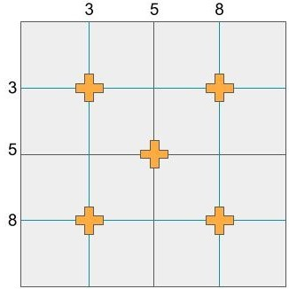
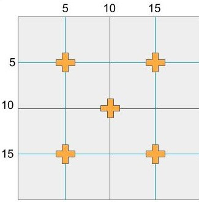

---
hide:
  - footer
---

### Background 
We measure nitrogen mineralization to better understand how species diversity and composition will affect nitrogen cycling in the system.

Note: Must wait 2 days after rain to collect soil. Nitrogen tends to pool from the rain so data taken after rain wouldn't be qualitative. Coring and tube installment can be done in one day; however, this would require help from at least 15 people to be completed in an 8-hour day.

### Materials Needed
#### Initial coring:
- Short metal soil corers						
- Meter stick
- Labeling tape						
- Clean incubation (pvc) tubes
- Red Caps						
- Labeled sandwich bags
- Plot map with areas designated to take cores			
- Coolers 
- Ice packs

#### Final coring
- Coolers						
- Ice packs
- Knives						
- Labeled sandwich bags

### Summary

Final products:

- Day 1 and 2:
    1. 10 Soil cores in quart-sized bags labeled with initial s barcodes
    2. 5 pvc tubes with red caps installed in each plot
        
- 30 days later:
    1. Soil from the 5 pvc tubes stored in quart-sized bags labeled with "final" s barcode labels
    
### Detailed methods
#### Day 1: Initial coring
1. Metal soil corers (approx. 3/4 in. diameter) are used to take the soil cores. Mark the cores with labeling tape at 15 cm from the tip of the corer.

2. Take 10 cores from 0-15cm per plot for the initial samples. The cores should be taken in the rows and columns marked in figures 1 and 2. Two cores for each location, five total locations for each plot.

3. Place all cores from a single plot into a labeled plastic sandwich bag. Do not damage the barcode label. Place the bag in a cooler. 

#### Day 2: Soil tubes

1. Use a sledge hammer to place one clean incubation tube (3/4" dia. PVC, 15 cm long), with a red cap, in each of the locations for each plot with a total of 5 tubes per plot. See figures 1 and 2 for placement locations. Place it near the initial cores.

#### 30 Days later: Final coring
1. Pull the five pvc tubes from a plot and place the soil from both tubes into a single labeled sandwich bag.
    a. Use a knife to tap the soil out of the tube.

2. Place the pvc tubes and the red caps in a garbage bag to be cleaned at a later day.
    1. If a tube is missing please record this on a datasheet.
    2. If a red cap is missing or cracked, do not place the soil from that tube in the sandwich bag and record this on the datasheet. 

3. Place the sample in a cooler.

              
Figures 1 and 2. Orange crosses represent sampling locations of 10m x 10m and 20m x 20m plots, respectively. The line represents the rows and columns in between the trees.
