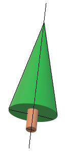

---
hide:
  - footer
---

### Background
This protocol details fall reproduction survey for FAB 1 and FAB 2 through Fulcrum App.

### Notes

- Flowering and fruiting for **maples** appear in the spring (April-May)
- Flowering and fruiting for **American basswood** starts in early-mid August and drop late summer to early fall. 
- Flowering for **Betula papyrifera** starts in the fall and will slowly drop.
- Surveys for **conifers** can be taken in the late fall since cone droppings are variable on cone age.
- Order of priority by species code for **fall** survey (as of 2022, will change as other species start reproducing): 
    - TIAM
    - BEPA
    - JUVI, PIBA, PIST, PIRE
    
- **Save as draft** is not an option since drafts will not sync to the cloud.
    
### Preparation

1. Download Fulcrum App on your mobile device

2. Use the log in details provided

3. Familiarize yourself with the reproduction parts in the [species list document]()
    - Understand the difference between reproduction and an insect gall

### Detailed Steps

1. Open Fulcrum App on your phone  
    *  Apps: FAB1 Growth and Reproduction and FAB2 Growth and Reproduction
    *  Go to Settings: 
        - Sort by: Date/Time Created
        - Ascending: Turn On
    *  When viewing **All Records**, the order of the lines are Listing number, Plot, Row, Column, Individual ID  
        - e.g. 1, 1, 1, 1, QUAL-2016-1  

2. Select **Filter**    
    * **+ Add Rule**   
        - Choose **Survey**
            * Operator: **Equals** or **Contains**; Value: **Yes**
                - Values are case sensitive
                - To confirm proper filtering, confirm that you have 31500 (FAB2) or 8960 (FAB1) records showing
        - Choose **Species Code**
            * Operator: **Equals** or **Contains**; Value: Chosen species to survey
                - If surveying multiple species, continue to add a new species code to the rules list  
        - If completing reproduction after growth measurements, add filter rule to include **Yes** for "Needs Reproduction Count"

3. Locate tree
    * When located, choose the correct line in fulcrum app, and scroll down. Click **Reproduction** 
    * If tree is dead, move on to the next tree.

4. Survey
    * At the bottom, choose **+ Record**
        - **Survey date**: defaults to the current date
        - **Live Branches Are Not Clearly Visible**: Respond "Yes" or "No"
            - Note: This is currently an issue in FAB 1 with dead lower branches. With only live branches at the canopy.
        - **Reproducing**: Respond "Yes" or "No"
        - **Reproduction Type**:
            * Choose the type of reproduction: Fruit, Flower, Cone
                - catkins are generalized as flowers
                - pine cone structures are referred to as its own type        
        - **Subsample_Count** (*only respond if reproducing*):  
            * **Yes**: count was completed  
            * **No**: count was not completed or reproduction cannot be completed e.g. live branches are at canopy and to count reproduction is not possible
            * **N/A**: count will be completed later  
            * Choosing what to subsample for reproduction count:
                - take reproduction counts for all individuals in plots of species richness 4 and above
                - when majority of an individual species are reproducing in bicultures and monocultures, subsample reproduction count
                    * skip counts of individuals along plot edges
                    * then choose every other individual for reproduction counts
                - if doing reproduction survey outside of growth survey, always do the reproduction count immediately
                - if doing reproduction survey during growth survey, choose N/A. 
                    * After saving, go back to main page for tree and choose "Yes" for Needs Reproduction Count and "No" for Reproduction complete 
        - **Reproduction Count**:
            * JUVI: reproduction categories
                - see table below for categories
                - an exact count is not needed for categories, if it is clear that it falls within a range, simply choose the corresponding category.
            * All other species: raw count
                - choose a quarter section of the tree as shown in Figure 1 below, count the quarter and multiply by 4. Enter in number. 
    * **Save**
        - fulcrum app was created with several requirement rules, you must fill in the requirements in order to save properly. 
        - After saving the reproduction data, on the main page for an individual:
            * Reproduction complete:
                - Yes: all questions are complete and doesn't need to be revisited with reproduction count
                - No: reproduction count still needs to be done
            * Needs Reproduction Count:
                - Yes: reproduction count still needs to be done
                - No: reproduction count is complete
            * Save before moving on to next individual
            
5. At the end of the day, **sync** the app
    * Choose the sync button at the right hand corner
      - sync button looks like a refresh button
            
### Brief Summary of Fulcrum App Steps
```
1. Add filters for Survey and Species Code

2. Choose individual

3. Go to Reproduction

4. + Record

5. Survey requirements
    a. Survey date
    b. Reproducing
    c. Reproduction Type
    d. Subsample_Count
    e. Reproduction Count
    f. SAVE

6. Main page requirements
    a. Reproduction complete
    b. Needs Reproduction Count
    c. SAVE
    
7. Repeat steps 2-6

8. Sync
```
**Juniperus virginiana Categories**
|Abundance Category|0|1|2|3|4|5|
|--|--|--|--|--|--|--|
|Category Ranges (# of berries)|0|1-2|3-10|11-100|101-1000|1001-5000|

**Figure 1**

