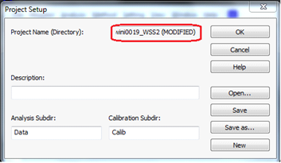
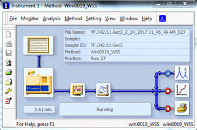
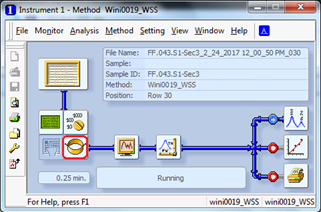
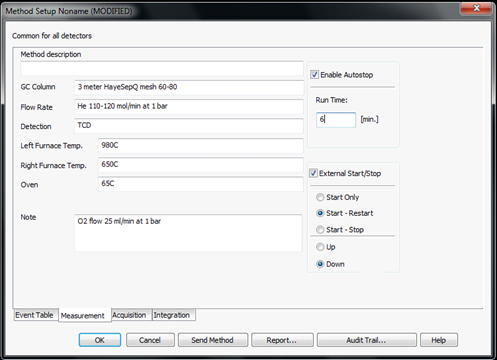
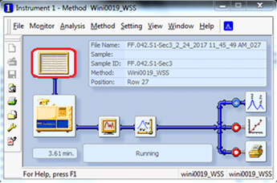
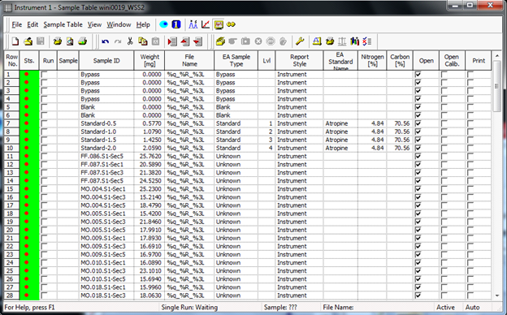
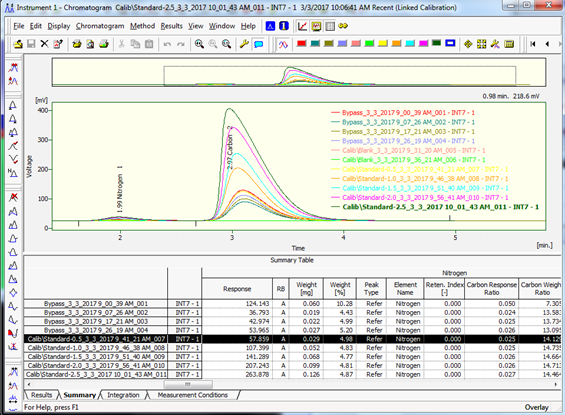
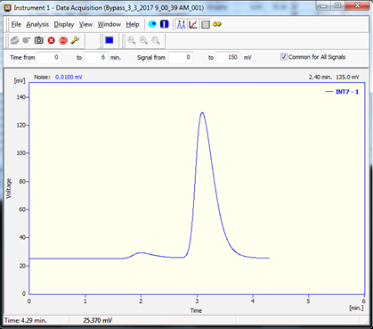

# Soil and Leaf Litter CN Protocol
###### Author
Cathleen Lapadat

###### Updated
15 December 2021

### Goal

Protocol for preparation and analysis of carbon and nitrogen for soil and leaf samples.

### Supplies/Equipment Needed

**If using any equipment for the first time, please contact the appropriate person prior to use**

-   Gloves
-   Tin capsules, Size: 5x9 mm; Costech Analytical Technologies Inc-> 041077
-   Tweezers
-   Microbalance
-   96 well plate
-   70% ethanol and Kim wipes for sanitizing
-   Elemental analyzer in Seabloom/Borer Lab -> contact Anita Krause

*For soils only*

-   ¼ inch diameter steel shot ammo (3/sample) -> Daisy brand on amazon
-   3/8 inch diameter steel shot ammo (1/sample) -> Daisy brand on amazon
-   O-ring; Grainger->1BUV5
-   Clear packing tape
-   Scintillation vials; 20mL HDPE
-   Paint shaker in Sarah Hobbie’s lab

*For leaf litter only*

-   Wiley Mill in Sarah Hobbie’s lab with # screen
-   Mask
-   Ear muffs
-   Storage for ground leaf litter (e.g. coin envelopes, paper bags, scintillation vials)

### Template

[Carbon and Nitrogen Template](https://docs.google.com/spreadsheets/d/1yN1cK68EgfawcR14fY14sgIyDxMRqhdy/edit?usp=sharing&ouid=117278050553426340443&rtpof=true&sd=true){:target="\_blank"}

### Sample Preparation

1. Soils
    1. Preparation for grinding soil: 
        1. Add 3 - ¼ inch steel shot ammos and 1 – 3/8 steel shot ammos to soil samples (if already labeled in scintillation vials and completely dried). 
        2. Add o-ring to neck of scintillation vial (this will help keep the lid in place). 
        3. Cover label with clear packing tape (to avoid wear-off during shaking). Also wrap clear packing tape around the lid (to avoid loosening during shaking).
    2. Paint shaker:  
        1. Add samples to paint cans in orderly and organized manner (important to keep samples in place during shaking). 
        2. Add any fillers to empty space (e.g. foam, paper). You want the paint can as filled as possible to avoid any movement from the scintillation vials. 
            1. If only filling one paint can, fill the other paint can to balance out the weight. 
        3. Close paint cans with lid. 
        4. Tighten the paint cans to the paint shaker and shake the samples for 120 minutes.  Soil samples should be super fine with no granules. Pebbles and rocks will not grind.

2. Leaf litter
    1. Wiley Mill is located in Sarah Hobbie’s lab. Make sure you wear a mask to protect yourself from debris and ear muffs as it is loud.
    2. Wipe down mill with ethanol between each sample and vacuum any debris. 

### Wrapping

1. Use microbalance in Sarah Hobbie’s lab. Please use the “Microbalance – Hobbie Lab” calendar to schedule your time. Contact Cathleen to be added to calendar. Refer to the SOP from the Seabloom/Borer lab below. Please contact Anita Krause (aporathk@umn.edu) to be trained to use the Elemental Analyzer and schedule dates to run samples. Each sample runs for ~6 minutes.

 

# Costech CN Elemental Analyzer

### Standard Operating Procedures

###### Author
Costech Analytical. 

###### Revisions and additions
Anita Porath-Krause and S.G. Winikoff

###### Updated
November 2019

**Please ask Anita Porath-Krause if you have additional questions or need clarification.**

### Weighing

*Weigh out samples, standards, and bypass in a Tin capsule (Pressed
5x9mm: recommend Costech Code 41077).*

1. Please provide your own tin capsules and weigh samples before using the Elemental Analyzer.  

2. Recommended: dry or desiccate samples prior to weighing (after grinding).

3. For each round or set of samples, include a series of standards, blanks, and bypass samples. For best results, follow sample preparation order bolded below. For example, samples 1-4 will be bypasses, 5-6 will be blanks, 7-10 will be standards, 11-N will be samples. Please pay attention to the number of runs tallied on the display of the analyzer. Anita will replace the insert and check the water trap every 150-180 runs.  Also, note that you will want to limit your samples to less than ~140 so that the proper maintenance can be performed, and results are robust. 

*Each set of samples should contain the following:*
1. Three to four bypass samples 
    1. Two bypass chemicals available: 
        1. Atropine – recommended use with soil.
        2. Acetanilide – recommended use with plant tissue.
    2. Weigh to approximately 0.5mg each.
    3. Z-fold, flatten, and ball.

2.  Prepare two blank tins
    1. Z-fold, flatten, and ball like the bypass.
    2. When run, expect a peak at the maximum of 2-3mv (not visible at normal values).
    3. Should not see peak – if do, assess problem.

3.  Measure four standard samples
    1. Use same chemical as bypass chemical.
    2. Weigh in a gradient.
        1. Example:  1 - 0.5mg, 2 – 1.0mg, 3 – 1.5mg, 4 – 2.0mg.
    3. Z-fold, flatten, and ball like the bypass and blanks.

4.  Measure unknown samples
    1. Again, limit to ~140 samples.
    2. Weight of the unknown will vary greatly on the type of tissue.
        1. Soil samples – recommend between 15 and 25mg
        2. Plant samples – recommend between 7 and 10mg
        3. Folding tins containing plant and soil tissue can be difficult and cause breaking of tins.  DO NOT USE SAMPLE IF TIN IS BROKEN.  Clean up after yourself and reweigh/prepare the sample.  
    3. Gentle, open z-fold with “Hershey kiss”-like twist.  Conform gently.  Do NOT ball tightly as tearing will occur.
    4. Measure an unknown quantity (between 0.4 and 0.9mg) of standard.
        1. Z-fold, flatten, and ball like the bypass and blanks.

### Run Elemental Analyzer

###### Start up

*Ensure Elemental Analyzer is Ready to Run*

1. Bring samples to room 440-A using a 96 well plate or some other form of containment. Place samples in each of the cells on the carousel of the auto-sampler, starting with the cell with the pin.
    1. The first sample will fall into the auto-sampler and cannot be seen – this is sample #1.

2. If you have properly signed up for the Elemental Analyzer, it should be in “Work” mode and the right, left, and oven lights below the display will be green (this means the furnaces are at temperature).  Additionally, the analyzer and all components will have been checked for leaks.  Sloppy sample preparation and gas leaks are the two biggest contributors to poor reads.  
    1. Leave the analyzer in the “chns, semi-micro” mode.  Please do not manipulate any part of the machine!  All changes for a normal sample run can be completed using the software.

*Put the Elemental Analyzer in REM mode*

3. On the analyzer, press “REMOTE”, then press “ENTER”.

4. “REM” will appear on the display on the analyzer.

###### Create Project

*Use the EAS Clarity software located on the computer desktop to setup
and run samples. Log-in information (e.g., “Name” and “password”) are
located on the computer tower (if not already logged in). EAS Clarity
icon* 

5. Click on the EAS Clarity icon (looks like a blue fertilized egg).
    
6. Login: 
    1. Create, then using the drop down arrow of “select project”, choose “new project”.  Then, enter name in “Enter user name”.  Assign your project the following “lastname_projectname_date”.
    2. Then Create Project with the same name
        1. This name will be attached to any reports or data you generate, so I suggest being specific to your own lab/project.
        2. Once the project is identified, this will open the Channel Window (looks like a flow chart).

  
**Figure 1.** Channel Window. You can access all elements of the EAS
software through this window.

*Create a project with a defined method*

7. In the Channel Window: File -> Project.
    1. This will open the Project Setup Window (label at top).
        1. The name in the “Project Name (Directory)” field should reflect your project name followed by (MODIFIED).  If this is the correct name, click OKAY.

  
**Figure 2.** Project Setup Window.

###### Settings

\*Click on the Coil icon 

8. Scroll over the image that looks like the Elemental Analyzer image in the Channel Window.  The coil icon is on the bottom right and will display the word “Measurement” when you scroll over it.*  

  
  
**Figure 3.** Channel Window. When you scroll over the image of the
elemental analyzer (bottom left) 3 icons appear, including the Coil icon
(bottom right).

9. This will take you to a window that says “Method Setup Project Name” – enter project name here.
    1. GC Column = 3 meter HayeSepQ mesh 60-80
    2. Flow rate = He 110-120 mol/min at 1 bar
    3. Detection = TCD
    4. Left Furnace Temp. =  980C
    5. Right Furnace Temp. =  650C
    6. Oven = 65C
    7. Notes = O2 flow 25ml/min at 1 bar

10. After the parameters are listed, make sure the following are activated/checked.
    1. Check = Enable Autostop 
    2. Check = Start:Restart
    3. Check = Down

11. Run time: 
    1. Start with 6 minutes. 
    2. Times will vary but an initial run time of 6 min is okay.

  
**Figure 4.** Method Setup Window. Be sure to fill in all the
appropriate fields, check appropriate boxes, and set the initial run
time to 6 minutes.

###### Sample Information

12. Save the method that you have created.
    1. Method Description:  your project name
    2. Click “Okay”
    3. Then, go back into the coil, and click “send method”, and then click “okay”.  
        1. After these steps, the Channel Window title and the method in the blue bar should match names.  If it does not, try to repeat above steps in save method.  If the names are still dissimilar, do not continue – ask for help.

13. Enter sample information.  NOTE - the Sample Table is similarly formatted as Excel so information can be pasted directly into the sample table.
    1. To access the Sample Table, click on the Sample Table icon located in the top left of the Method Display.  

  
**Figure 5.** Channel Window with the Sample Table icon outlined in red.

14. In the Sample Table under the Sample ID column, add your sample names (i.e. bypass, blank, standard name, and unknown). 

15. In Weight [mg] column, enter mass (mg) of the standards and the unknowns.  A mass is not required for the bypass or blanks. 

16. Complete EA Sample Type column using dropdown choices.

17. Enter an EA Standard Name for the standards. The standard name is the chemical that you used for your standards. Filling in this field should automatically fill in expected %N and %C values.

18. In Lvl column, enter 1, 2, 3, 4, and (if needed) 5 to the appropriate standard quantity.  The levels will be based on weight of the sample – with Lvl of 1 for the lightest (by weight) standard and 5 for the heaviest.  
    1. The sample table is similarly formatted as Excel - Can paste in information.

19. File -> Save As, your project name, this will connect to the project.

  
**Figure 6.** Sample Table Window. Notice the fields mentioned in text,
including the Sample ID, Weight (mg), EA Sample Type, Lvl, and EA
Standard Name fields.

###### Calibration

*Connecting Calibration Window to Sample Table.*  
*x/y-axis icon:* 

20. In the Sample Table, click on the x/y-axis icon at the top of the screen to open the Calibration Window.

21. Check that the Calibration Window matches the project name.
    1. You will see a split window with three tabs at the bottom; Elements, Nitrogen, and Carbon

###### Chromatogram Window

*View Chromatogram Window*  
*chromatogram icon* *x/y-axis icon:* 

22. In Sample Table, click on the Chromatogram icon at the top of the screen to open the Chromatogram Window.
    1. Check that the Overlay Mode is selected by clicking File -> Overlay Mode.

23. From here, you will be able to watch the different elements peak (N – first, typically smaller peak), (C – second, typically larger peak) while the machine runs the samples.

24. Each set of N and C peaks are overlain onto one another, so throughout the run you will have multiple peaks appear. 

  
**Figure 7.** Chromatogram Window. Notice that peaks are overlain and
identified using color codes. To see a similar image, make sure you are
on the Summary tab.

###### Data Acquisition

*View the Data Acquisition Window*  
*Data acquisition icon:* 

25. In Sample Table, click on the Data Acquisition icon  at the top of the screen to open the Data Acquisition Window. This window will allow you to observe N and C peaks in real time. 

  
Figure 8. Data Acquisition Window. From this window you can observe N (left) and C (right) peaks in real time.

*Running the Samples*  
*One icon:* 

26. In the Sample Table, check the box to run the first sample.  

27. Click on Sample Table -> Run
    1. Using the viewer through the autosampler, make sure the combustion of the first sample looks normal.
    2. Normal combustion is characterized by a bright orange glow. You can usually see the sample move immediately after the viewing window opens. 
    3. If a normal combustion of a sample is not observed, none of the remaining samples will combust normally and the data collected will be very poor.  

28. If combustion is normal, go to the Data Acquisition Window by clicking the Data Acquisition icon  to observe the peaks of N and C in real time.  The Data Acquisition icon can be found in the Channel Window or in the Sample Table. 
    1. In the Data Acquisition Window, a baseline will be given at about three millivolts when N and C are not being measured.  The baseline value can be adjusted if necessary, but you will need to see Anita Krause for assistance.
    2. Observe and the time it takes to reach and measure the full N and C peaks in the Data Acquisition Window.  
        1. If the N and C peaks are not being captured or measured accurately (e.g., if you have an Error Message from the software), then you can adjust the peak detection from the Chromatogram Window.
            1. Click on the Chromatogram icon   to access the Chromatogram Window.
            2. Under Retention Time column (in the bottom left portion of the window), change the actual time peaks measure for N and C.
        2. If the total time to complete both peaks is longer or shorter than the 6 minute original designation then change this value accordingly.
            1. To change Run Time, click on the One icon   located at the top of the Data Acquisition Window, Chromatogram Window, or Sample Table Window. This will take you to the Channel Window.
            2. Select the Coil icon   -> change run time to whatever is best based on your bypass samples -> Okay
            3. File -> Save method -> Okay
    3. Again, File -> Save method (may not be an option, but if it is, select Okay).
    4. Log out of EAS software then log back in - this ensures software will talk to machine.

29. When all changes in 4c are complete, run all samples.
    1. Check all run boxes
    2. Click File->Save
    3. Click Sample Table->Run

###### Quality Check

*Check the quality of the runs*

30. In the Chromatogram Window click on the Summary Tab. A Summary Table should appear.  

31. Scroll to the right until you are in the Nitrogen Section looking at the column called “Carbon Response Ratio”. This shows the area of the N peak divided by the area of the C peak and should have a fixed ratio in your Standards. 
    1. For standards:
        1. Typically 0.024 +/- 0.003 for atropine
        2. Typically 0.056 +/- 0.003 for acetanilide
    2. Unless the blanks were contaminated, they will be dropped and not visible in the Summary Table.
    3. If there is less than 2% difference in C weight between the 1st and last standards, runs can be considered normal and data can be assumed robust.

  
**Figure 9.** Summary Table located in the Chromatogram Window. When
checking whether the standards were measured accurately, view the Carbon
Response Ratio (outlined in red) beneath the Nitrogen section of the
Summary Table.

###### Export Data

*Export Data*

32. Navigate to the Summary Table located in the Chromatogram Window.

33. Click File -> Export -> Export Summary Table (as a TXT ANSI) to an external drive

###### Conclusion

*Finishing a Run*

34. When you have finished collecting your data, please Log Out of EAS Clarity.

35. DO NOT put the computer to sleep or shut down.
    1. Turn off the computer monitor.  
    2. Complete the Use Log and Pay Here pages (including justification) in the binder located beside the Elemental Analyzer. 
    3. Please clean up the station.
    4. On the Elemental Analyzer machine: press "Abort", then press “ENTER”. This will take the machine out of REM mode.
    5. On the Elemental Analyzer machine: press "Standby", then press “ENTER”. This will cool down the machine.
    6. Inform Anita when you are finished.  
