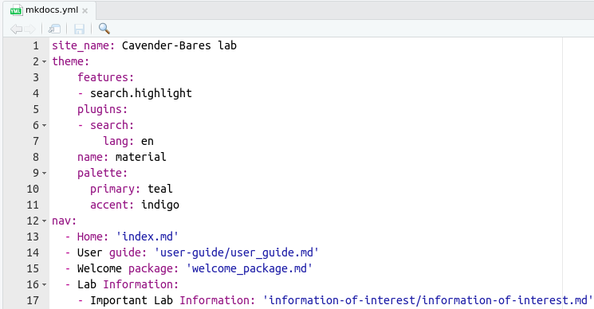

# User guide

### Objective of Webpage

Create, remove, and update documentation is essential for any organization. This webpage was created for this aim using [Mkdocs](https://www.mkdocs.org/){:target="\_blank"} to satisfy the documentation requirements for the lab.

This webpage does not replace data storage requirements (e.g., group/LAB-cavender, google drive, or local drives). However, it allows users to respond to the following questions:

-   Where is the data?
-   How the data was collected?
-   What protocol I need to follow?
-   I am new here, what I need to do?
-   Among many others…

If you need to update documentation please contact the current data manager, Cathleen.

 

### Webpage Development

To build this webpage, users must install on their computer:

- [RStudio](https://www.rstudio.com/products/rstudio/download/){:target="\_blank"} and [R](https://www.r-project.org/){:target="\_blank"}.
- Rmarkdown and Knitr packages (e.g, `install.packages("rmarkdown")`).
- [pip](https://pip.pypa.io/en/stable/cli/pip_install/){:target="\_blank"}
- [MkDocs](https://www.mkdocs.org/){:target="\_blank"} (e.g., in terminal `pip install mkdocs`)
    - MkDocs material theme (e.i., in terminal `pip install mkdocs-material`)
    - [List](https://docs.google.com/document/d/1VhgMGTmMjAhdxE6Dev_q97PhnedacdC9dYWNkbd4CMA/edit?usp=share_link){:target="\_blank"} of additional installation packages required
- [git](https://git-scm.com/downloads){:target="\_blank"} and Github account.

**Note**: You need the latest update of python 3. If your pip installs are resulting in error, try `pip3`.

 

#### Step 1 - Clone webpage repository

Confirm that you have the latest versions of R, Rstudio, python, mkdocs, and pip.

To clone the github repository to your local machine using RStudio:

    File > New Project ... > Select Version Control > Select Git 

In the ‘clone git repository’ window, add the following URL `https://github.com/Cavender-Bares-Lab/Data-management-lab.git` and choose the project path of your preference.

If multiple people are working on the repository or you are working from multiple computers, you always need the most updated repository. To do so, click on the `Git` panel and then `pull`. Remember that you will need git credentials.

##### Help

This first step requires basic git skills, if you need help, refer to this [guide](https://www.geo.uzh.ch/microsite/reproducible_research/post/rr-rstudio-git/){:target="\_blank"}.

For webpage theme customization, refer to the following links:

* For step by step guidance, refer to [Material webpage](https://squidfunk.github.io/mkdocs-material/){:target="\_blank"}
* For help with issues, refer to [Material github repository](https://github.com/squidfunk/mkdocs-material){:target="\_blank"}

 

#### Step 2 - Mkdocs

This webpage is composed of two elements: the structure and the documentation.

- The **structure** refers to the online appearance of the documentation, and it is controlled by `mkdocs.yml` file. In this file, under `nav:` you will see the structure of how the documentation and web sections will be displayed; their sections, tabs, and sub-tabs.

- The **documentation** refers to the `.md` files located in the docs folder. These files contain all the information required that will be displayed in the webpage. It is good practice to keep these files in folders under docs with names relatives to tabs and sub-tabs, just to keep the webpage in order.

Now that we know these elements, let’s take a look at three functions of `MkDocs` that we will need. In RStudio you can run these commands using the ‘Terminal’ (the tab next to ‘Console’ that we always use).

- `mkdocs serve`: this command creates a local address to view the documentation in real time. This local address is `http://127.0.0.1:8000/` and it can be opened on your web browser.

- `mkdocs build`: this command helps you to build the page. A step that need to be conducted close to the end of a session.

- `mkdocs gh-deploy`: this command will deploy the update the webpage to github pages.

You can type these commands in the terminal to run them. In some cases (Windows most likely), you need to type extra arguments to run them, e.g. `python -m mkdocs serve`.

 

#### Step 3 - Create a documentation file

An easy way to build your documentation is to create a Rmarkdown (`.Rmd`) file. For this guide, let’s assume that you need to document `your_new_protocol` in the protocols section of the lab. You can create the `.Rmd` file following:

    File > New File > R Markdown > OK

In this new file you can remove all non-essential information and keep the header document similar like:

    title: "Your title for the page"
    date: "2022-01-01"
    output: md_document
    author: "Your name"

Please pay attention to the `output:` section that needs to be `md_document` and NOT `html_document`. An essential step for what is coming.

Once you create the file and their structure, you then can write or copy/paste the information that you want to convey in `your_new_protocol` file. This file uses the writing syntax of [rmarkdown](https://rmarkdown.rstudio.com/){:target="\_blank"}; thus it is recommend to follow basic guidelines for doing an elegant document. A quick introduction to rmarkdown is this [cheat sheet](https://www.rstudio.com/wp-content/uploads/2015/02/rmarkdown-cheatsheet.pdf){:target="\_blank"}.

Let’s assume that you finished to write your documentation. You can then save the file in a folder of interest under `docs`. For instance, if you are writing about a protocol, so you can save `your_new_protocol.Rmd` file in a path like `docs/protocols/your_new_protocol.Rmd`.

Once you storage the file in the corresponding folder, you can `Knit` it. But what is this? `Knit`, for this context, is a process to transform the rmarkdown extension (`.Rmd`) to markdown (`.md`); the extension required for `Mkdocs`. You can `Knit` the file pressing the knit button close to save, at the top of your rmarkdown document. If everything goes well, you will see a new file `docs/protocols/your_new_protocol.md`.

##### Markdown
It is also possible to directly create and edit in a Markdown file. `File > New File > Markdown. This is ideal since many customization features available through Material theme is not transferred properly from .Rmd to .md.

###### Mathjax
For math syntax, refer to [Mathjax basic tutorial and reference](https://math.meta.stackexchange.com/questions/5020/mathjax-basic-tutorial-and-quick-reference/25054#25054){:target="\_blank"}
 

#### Step 4 - Edit mkdocs.yml

The `mkdocs.yml` file is located within the `Data-management-lab` folder outside of `docs` and `site`.

Please familiarize yourself with the details and structure of the file first.

Find `nav:` section. Within the topic of interest under `nav:`, you will need to add the `.md` file created in Step 3. For instance, to add this user guide as documentation for the page, the `user_guide.md` was added in the `User guide:` section. Please note that when adding the `.md` file you need to specify the path where it is located, starting off from `docs` as root.

Following `your_new_protocol` example, your documentation should be added below the `- Protocols:` tab in a new section called `- Your New Protocol:`.

      - Protocols:
        - Your New Protocol: 'protocols/your_new_protocol.md'

Save the `mkdocs.yml` to build the page in the next step.

 

#### Step 5 - Build webpage

Click on the "Terminal" tab in Rstudio. To view the webpage in real time, type `mkdocs serve`. The local address will appear in the terminal `http://http://127.0.0.1:8000/`. Click on the address to view the webpage on your browser.

To close the `mkdocs serve` in the terminal (Control + C), and build the `html` files by typing `mkdocs build` in the terminal. This last command will create several files.

 

#### Step 6 - Publish webpage

To **publish** the webpage with updates/edits, type `mkdocs gh-deploy`.

To **save** the edits to the repository, in the terminal, type `git add .`. Click on "Commit" in the Git tab and write a brief description in the "Commit message". Click "Commit" and when complete, "Push" to update the repository. "Push" and "pull" are very important features when multiple people are making edits to the repository.

 

#### Questions

For more information on mkdocs, refer to this [blog](https://ronnyhdez.github.io/blog/posts/2021-12-11-usingmkdocsrmd/){:target="\_blank"} and [webpage](https://www.mkdocs.org/){:target="\_blank"}.
