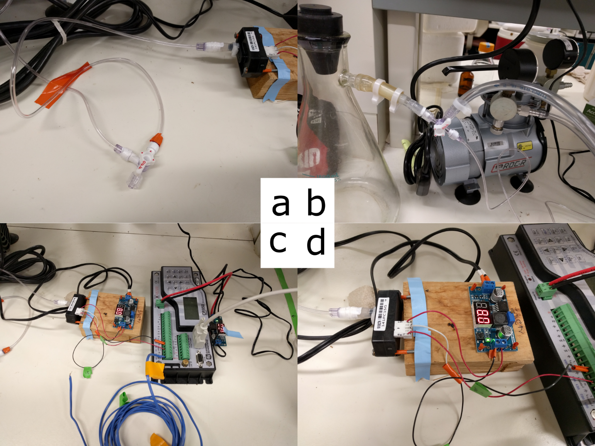
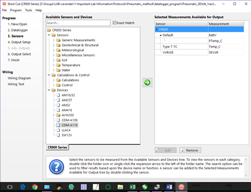
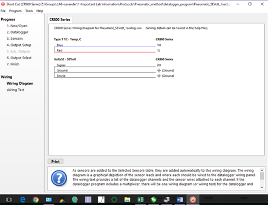

###### Author: Beth Fallon; Updated: 15 February 2018

### Goal
##### Pneumatic protocol for measuring stem embolism and developing xylem vulnerability curves

This method uses vacuum pressure to extract air, presumed to be in the xylem and the result of embolism, from leafy stem section. This outlines the 1) protocol for setting up an apparatus to measure differences in air volume present in stems and build a proxy hydraulic vulnerability curve and 2) the general measurement procedure.

### Full citation to methods 
Pereira, L, PRL Bittencourt, RS Oliveira, MBM Junior, FV Barros, RV Ribeiro, and P Mazzafera. 2016. Plant pneumatics: stem air flow is related to embolism – new perspectives on methods in plant hydraulics. New Phytologist. doi: 110.111/nph.13905

### Template
[Pneumatic Method Manual Datalog](https://docs.google.com/spreadsheets/d/1KXQ5IoYeEURCN-4k8t9gBN5yb6eKQsCu/edit?usp=sharing&ouid=117278050553426340443&rtpof=true&sd=true)  

### Contents  
##### Apparatus set-up and tests  
1.	Datalogger and transducer  
2.	System volume  
3.	Sealing connections  
4.	Leak tests  

##### Measurements  
##### Appendices  
A.	Pressure transducer voltage to pressure conversion   
B.	Equations for calculating pressure, moles discharged, air discharged, percent air discharged  
C.	Apparatus photos  
D.	Campbell datalogger programming  
E.	Concerns about the method  

### Apparatus set-up and tests

##### 1.	Datalogger and transducer
```  
  a.	Pressure transducer: the Omega PX141-015V5V
      i.	This reads only negative, or vacuum pressures, and should not be positively pressurized (beyond atmospheric) because the internal pressure plates can become deformed
      ii.   Wiring
          1.	Voltage input should be 8V, deviation from this input can affect voltage out and this accuracy of conversion to a pressure unit
            a.	Use a step down voltage regulator (like this one sold on Amazon) to convert higher DC voltage from a 12V input into 8V to the transducer
          2.	 Use a 3 prong connector (Omega CX136-3, push-on wire connector) to connect a positive wire into the connector and positive out. A single split grounding wire can be both the grounding in and out (see p 4/5 of product documentation for wiring diagram)
            a.	These connectors are possibly crimpable for a connection with input/output wires, but I found that they needed to be soldered in place (to wire, not transducer) for a consistent connection
  
  b.	Campbell datalogger or other equivalent (currently using 850x)
      i.    Datalogger is necessary for more accurate readings and timing of tests: 
          1.	If you want three minutes, or x seconds, of pressure change for each individual measurement, the most exact method will be using a datalogger (paired with manual logs of approximate start and stop time) to find initial and final voltage (=pressure)
          2.	The datalogger can log voltage out every second for a high resolution of change
      ii.   Software interface
          1.	PC200W datalogger software from Campbell Scientific (https://www.campbellsci.com/pc200w)
            a.	Allows connection with any Campbell datalogger, writing and retrieving programs, monitoring and collecting data
      iii.	Collect air temperature and voltage out from the pressure transducer
          1.	Use a simple copper-constantin thermocouple to monitor air T
          2.	Use simple voltage connection (see the program, Pneumatic_SEVolt_1seclog, for example)
          3.	Monitor and sample every second, be sure to collect data daily from logger because the logs are extensive and time consuming to download
  
  c.	Initial set up
      i.    Install all wiring to the pressure transducer and connect to the datalogger
      ii.   Connect a computer to the datalogger using the PC200W software
          1.	Use a Serial to USB connection and specify the connection port when connecting
      iii.	Make sure to Set the Clocks (right side of first PC200W tab “Clock/Program”) so that the computer and datalogger are synced
      iv.   Under the Collect data tab, select the first table of the program (should have set for 1 sec sample output of air temperature and voltage) and choose an output location. Unless otherwise desired, ensure the radio button to append new data (rather than overwrite) is selected
          1.	I made a new output file each day to reduce file size
      v.    Under the Monitor Data tab, select Add and Table 1 to see the time, temperature and voltage output
      vi.   In an unpressurized system, the voltage output should be the atmospheric pressure: the gage should read kPaatm/100=Vout.  
```
##### 2.	System volume
```
  a.	Measuring
      i.    The effective reservoir for measurement is from the stem base to the pressure transducer, excluding the arm of the stopcock that is an outlet to the larger vacuum system. This is primarily the volume of the single piece of tubing (EW-30600-62 Cole Parmer, ID = 0.065” = 1.651mm, L = 24” = 609.6mm), but should include the volumes of all other components. 
      ii.   See the spreadsheet, “Pneumatic_method_manual_datalog” sheet “V_calc” for an example. Volume should be given in L (air discharged, AD, is calculated in uL).

  b.	Error in measures
      i.    As the test reservoir increases in size, the ability to detect small changes in air discharge decreases (error rate of pressure gage is ±0.5% of span = .005 * 5V = 0.025V), see sheet in “Pneumatic_method_manual_datalog” “Reservoir error calc” to see impact of initial test reservoir size (
      ii.   Recommend keeping the size to 1 reservoir. Can detect a loss of 800uL of air from a stem and a minimum loss of 7uL
      iii.	If stem quickly loses more than the maximum capacity, can refill the vacuum and continue to extract—however large losses (in small stems) are as likely to be leaks as real air within the stem
```

##### 3.	Sealing connections
```
  a.	Multiple iterations of leak tests (see section 4, below) and sealing connections should be done in system preparation

  b.	Water can build up in the tubing (should be checked for water droplets in between measurements) and should be checked during measurements, so having permanent seals between reservoir tubing and transducer is not recommended. 

  c.	Teflon tape within and around all connections reduces most leakage

  d.	Closing the stopcock to the vacuum pump after initial depressurization reduces air entry within the larger system
```
##### 4.	Leak tests
```
  a.	Leak tests are best performed, and closest to general measurement set up, when using a sealed stem (gel superglue over cuts) clamped into silicone tubing and connect to the vacuum reservoir

  b.	Perform a leak test at the start of and end of testing (or multiple times throughout testing for more accuracy) for the same amount of time as stems are tested

  c.	It seems that small amounts of leakage are unavoidable, but can be limited to < 5uL air/3min. Care should be taken when taping connections and setting up the system to ensure that leakage is low
  
  d.	Using a simple cap and FtoF luer for initial system tests can show how much leakage there is without a stem in the system
```

### Measurements
```
1.	Measure plants (height.bsd) before harvest

2.	Stem harvest:20- 40cm of stem with at least 6 healthy leaves
  a.	Mark stem with tape to ID
  b.	Cut under water and place in floral tube with dH2O
  c.	cover 1-2 leaves with saran wrap (to reduce transpiration) and then foil
  d.	Cover with thick black plastic bag and let equilibrate for 1 hour.

3.	Record for each sample
  a.	include length and bsd of each test stem

4.	Measure air pressure in lab
  a.	with Barometer app (phone reads 97.5 when LiCor 6400 reads 97.25kPa)
      i.    record at start and stop

5.	Start transducer 
  a.	Switch Campbell sci logger to on. 
  b.	plug in transducer and make sure voltage out is at 8V (on display)
      i.    Any swing away from an input voltage of 8V will affect voltage output 

6.	Datalogger set 
  a.	Append all existing data to datafile
  b.	Resync datalogger to system clock (correct sec error) 
  c.	Resend program (this must be done or mismatch in time will cause problems)

7.	Transducer check
  a.	With stem inlet stopcock open to all three flows (whole system at atmosphere), make sure that the voltage out is similar to current atmospheric pressure, ex.97V=97kPa

8.	System vacuum and Measure system error:
  a.	check all connections; add parafilm/Teflon tape to any adjusted connections
  b.	With stem inlet stopcock all the way open (whole system at atmospheric pressure)
  c.	Close stopcock to stem inlet and open 3-way stopcock at vacuum pump
  d.	Depressurize to -4.2 -  -4kPa and close stopcock to vacuum pump, let stabilize
  e.	System leakage
  i.	measure 1-2 times/day as noted in Equipment section

9.	Stem connections
  a.	Keep stem in large black bag with damp paper towels in between all measure/dehydration steps
  b.	Before removing from water, immediately remove a foil covered leaf and bag for water potential tests
      i.    Glue cut
  c.	Prep
      i.    measure stem length and bsd
      ii.   Dry stem gently to remove excess water and make new clean cut with razor
      iii.	Insert into tight fit silicone tubing (using an ID 2-3mm smaller than stem diameter) and insert M to F luer  on opposite end of tube to almost stem end (to keep reservoir size uniform)
      iv.   Clamp tubing around stem (with a hose clamp or hand tightened zip tie)
      v.    Glue stem, with latex glue, at silicone tubing 
      vi.	  Teflon tape over female end of luer and hose clamp over connection
      vii.	Hook quickly to system

10.	Measure
  a.	Close stopcock to larger vacuum reservoir, so that it is open only between transducer and stem
  b.	Record initial voltage as pressure after immediate drop (initial drop is due to air in the stem connection tube, since that isn’t under vacuum
  c.	If using a datalogger
      i.    Also record start time for analyses, with seconds
  d.	Measure for 3-5 minutes
      i.    I want three minutes, which on tests of Q. virginiana captured large losses, and after which losses were small, until they increased again likely due to dehydration during measurement
  e.	Record final voltage and time
  f.	Record room temperature near reservoir (or record this measurement once or twice a day if room temp is stable)
  g.	Close stopcock to stem outlet and remove stem, let bench dry

11.	Leaf water potential
  a.	Leaves should be removed right before each stem measure (should have been foil covered)	
  b.	Cut should be covered with latex glue
  c.	leaves should be sealed in humid whirlpak bags
  d.	measured water potential within a few minutes (before next stem measure)

12.	Drying plants
  a.	Record time dried on spreadsheet
      i.    Some plants need only a few minutes to an hour to drop 1MPa in stem water potential
      ii.   Plants may need to dry overnight to reduce water potential
      iii.	Ideally, the ADmax is measured on a stem that has only a small amount of water escaping from the xylem (is almost fully dehydrated) but is measured before reaching the limits of the pressure chamber (-8MPa in my case)
  b.	At start of drying, when stem exposed, wrap and foil cover another new leaf 
      i.    Oaks seemed to perform better and more consistently in terms of increasing embolism with declining stem water potential when drying stem ends were loosely wrapped (not completely sealed) with parafilm. I have some concerns about formation of tyloses and perhaps a slightly more humid environment prevents that.
  c.	After set drying time, place stem in humidified dark bag and let equilibrate for at least 30 minutes
```
### Appendix A: Pressure transducer voltage conversion

   
 
**Figure 1** the Omega vacuum gage pressure transducer PX141-015V5V does not come with individual calibrations, but, when voltage in is 8V, the conversion from voltage to pressure (absolute not vacuum) is 0psi at 1V and -15psi at 6V. This conversion in kPa is as above. At atmospheric pressure, the gauge should read ~kPa~atm~/100=V~out~.   
 
### Appendix B: Equations  

The pneumatic method uses the amount air in the stem (removed by vacuum) as a proxy for embolism. Drying down of the stem between measurements, combined with measures of stem-equilibrated leaves, produces a Ψ by PAD (percent air discharged) vulnerability curve.  

##### Equations
```
1) Stem segment conductance, following (Tyree and Ewers 1991), where K equals the sum of individual conductance of each non-embolized vessel (Ki)

K=∑Ki〖Ki=(n-e)Ki=(n-e)αD^4 L^(-1) 〗
```
Variable  | Variable definition                 | Units
----------|-------------------------------------|---------------------
*K*       | segment conductance	                | kg MPa^-1^ s^-1^
*n*       | number of vessels	                  |
*L*       | vessel length (assumed to be equal)	| m
*D*       | diameter of vessels	                | m
*e*       | number of embolized vessels         |	
*α*       | constant following Poiseuille’s law	| kg s m^-3^ MPa^-1^


```
2) If non-vessel air is negligible, then the volume of air in the same segment will be the volume of the sum of all the embolized vessels. 

V=∑Vi〖Vi=〖eVi〗=eπ(0.5D)^2 L〗
```
Variable  | Variable definition                 | Units
----------|-------------------------------------|-------------
*V*       | air volume of vessel                | l
*L*       | vessel length (assumed to be equal) | m
*D*       | diameter of vessels               	| m
*e*       | number of embolized vessels	        | 
```
3) Increase in moles of air, under vacuum, in the vacuum reservoir, as expected under ideal gas law (which should apply to O2, N2, CO2 and any atmospheric air under low pressure and room temperature)

∆n=n_f-n_i=(P_i V_r)⁄RT-(P_f V_r)⁄RT
```
Variable  | Variable definition                          | Units
----------|----------------------------------------------|----------------------
*V~r~*    | Volume of the vacuum reservoir               | l
*P*       | initial and final pressure within reservoir  | kPa
*n*       | number of moles (initial and final)	         | mol
*R*       | gas constant: 8.314                          | kPa L mol^-1^ K^-1^
*T*       | room temperature                             | Kelvin	

```
4) Total volume of air discharged in to the vacuum reservoir

AD=(∆nRT⁄P_atm )×10^6
```
Variable  | Variable definition                          | Units
----------|----------------------------------------------|---------------------
*AD*      | Volume of air discharged                     | μL
*P~atm~*  | atmospheric pressure (98kPa at 700m)         | kPa
*n*       | change in number of moles, see eqn 3         | mol
*R*       | gas constant: 8.314                          | kPa L mol^-1^ K^-1^
*T*       | room temperature                             | Kelvin	

```
5) Normalizing the AD values, as a percentage of the total change between hydrated and dehydrated stems

PAD=100×((AD-〖AD〗_min ))⁄((〖AD〗_max-〖AD〗_min ) )
```
Variable  | Variable definition                          | Units
----------|----------------------------------------------|------------------
*AD*      | Volume of air discharged                     | μL
*P~atm~*  | atmospheric pressure (98kPa at 700m)         | kPa  

### Appendix C: Apparatus Photos  

  

**Figure 2.** a) Test reservoir, connected to pressure transducer and included 3-way stopcock. Stem would be connected to outlet. During measurements the stopcock will be closed to the larger vacuum reservoir on the left (non-orange outlet). b) Vacuum reservoir. Stopcock is currently closed to vacuum pump, when left open, air leaks in when the pump is not running. c) Datalogger and pressure transducer. Large blue wire is copper/constantin thermocouple. d) Pressure transducer and step-down voltage regulator. The voltage in is a 12V DC wall outlet (top of voltage regulator), the voltage out to the pressure transducer is set at 8V. Wires into the pressure run from the step-down regulator to the white connector. The ground wire into and out of the connector are spliced into 1 wire.  

### Appendix D: Campbell Datalogger program recommendation  

The program needs to log temperature and voltage, preferably every second for high resolution recording of changes.   

   
**Figure 3.** Here’s an example of the measurements selected in the ShortCut or PCW200 Campbell Scientific Software datalogger interface.  
-------------------------------------------------------------------------------------------

   
**Figure 4.** Wiring diagram for the program.  
-------------------------------------------------------------------------------------------

   
**Figure 5.** Sample table in the example program. Sampling is every 1 second.  

### Appendix E: Concerns about the method

*	The vacuum strength at measurement could have a large effect on air out so it should be kept fairly standardized at least within measurements of any one individual stem—I’m trying to keep vacuum reservoir near 4.2, which drops to 4V at measure which is 62kPa at measure (when using 8V supply)  
    +	    Additionally, the argument that there is an exponential drop in air loss in  Pereira et al. (2016) would seem confounded with the fact that vacuum strength drops as air is added  
*	The ADmax measure may be subjective. It is essentially the highest measure that can be made for that plant, but that is just defined by equipment. I can measure -8MPa, so the AD of a measure near that will be ADmax. It wouldn’t seem that the method would be very robust without most plants reaching that measure. 
    +     I have settled on trying to reach max capacity of chamber or stopping when very little sap emerges from xylem—this is apparent when only small bubbles emerge from tiny sections of the petiole xylem indicating that very little water remains in the stem.   
* Re: my branches, they found that vessel length wasn’t significantly correlated with PAD. But the authors also took the precaution of using smaller aerial shoots hoping that would include vessel ends. Some of the shoots I’ve used have been multi-branched (so that they contain enough leaves). Perhaps I should collect more small shoots with at least 4-6 leaves and aim for just 3-4 measurements per—these may also dehydrate more quickly
