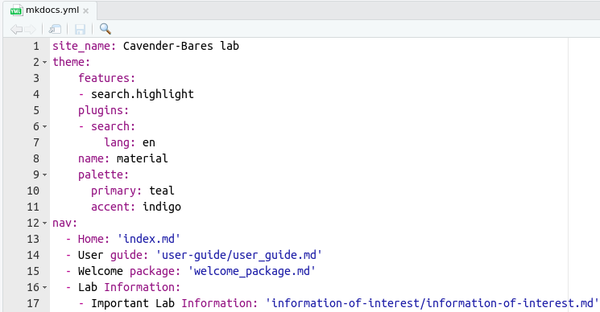

# User guide

### Why this webpage?

Create, remove, and update documentation is essential for any organization. 
This webpage was created for this aim using [Mkdocs](https://www.mkdocs.org/) to 
satisfy the documentation requirements for the lab. 

This webpage does not replace data storage requirements (e.g., group/cavender, 
google drive, or local drives). However, it allows users to respond questions like: 

- Where is the data?
- How the data was collected? 
- What protocol I need to be follow?
- I am new here, what I need to do?
- Among many others ...

If you need to create, remove, or update documentation please follow the below 
guide, or ask the lab-technician for help.

<br>

### How to build this webpage?

To build this webpage, users must install on their computer:

- [RStudio](https://www.rstudio.com/products/rstudio/download/) and [R](https://www.r-project.org/).
- Rmarkdown and Knitr packages (e.g, `install.packages("rmarkdown")`).
- [pip](https://pip.pypa.io/en/stable/cli/pip_install/) 
- [MkDocs](https://www.mkdocs.org/) (e.g., in terminal `pip install mkdocs`)
- MkDocs material theme (e.i., in terminal `pip install mkdocs-material`)
- [git](https://git-scm.com/downloads) and Github account.

<br>

#### Step 1 - Clone or update the webpage repository in your local machine.

If you and someone has been working on this webpage or you recently started, it is 
crucial to have the updated version. 

If you recently started, you can clone the github repository to your local machine
using RStudio following:

```
File > New Project ... > Select Version Control > Select Git 
```

You will see a 'clone git repository' window, add there the following URL
`https://github.com/Cavender-Bares-Lab/Data-management-lab.git` and chose the 
project path of your preference.

In case you have been working on this webpage using RStudio interface, 
it is a good practice to check if you have an updated version. For doing so, you only 
need to click on the `Git` panel and then click on `pull`. Remember that you will 
need git credentials.

This first step requires basic git skills, if you are a bit lost take a look 
at this [guide](https://www.geo.uzh.ch/microsite/reproducible_research/post/rr-rstudio-git/).

<br>

#### Step 2 - Let's get familiar with Mkdocs.

In non-technical words, this webpage is composed of two elements: the structure and
the documentation.

- The structure refers to the online appearance of the documentation, and it is 
  controlled by `mkdocs.yml` file. In this file, under `nav:` you will see the 
  structure of how the documentation and web sections will be displayed; their 
  sections, tabs, and sub-tabs.
  
- The documentation refers to the `.md` files located in the docs folder. These files
  contains all the information required that will be displayed in the webpage. It is 
  good practice to keep these files in folders under docs with names relatives 
  to tabs and sub-tabs, just to keep the webpage in order.

Now that we know these elements, let's take a look at three functions of `MkDocs` 
that we will need. In RStudio you can run these commands using the 'Terminal'
(the tab next to 'Console' that we always use).

- `mkdocs serve`: this command helps you to create local address where you can see the
  changes in our documentation in real time. This address tend to be `http://127.0.0.1:8000/`
  and it can opened using your browser.
  
- `mkdocs build`: this command helps you to build the page. An step that need to be
  conducted close to the end of a session.
  
- `mkdocs gh-deploy`: this command will deploy the update the webpage to github
  pages.
  
You can type these commands in the terminal to run them. 
In some cases (Windows most likely), you need to type extra arguments to run 
them, like `python -m mkdocs serve`.


<br>

#### Step 3 - Let's create a documentation file.

An easy way to build your documentation is to do create a Rmarkdown (`.Rmd`) file. 
For this guide, let's assume that you need to document `your_new_protocol` in the 
protocols section of the lab. You can create the `.Rmd` file following:

```
File > New File > R Markdown > OK
```

In this new file you can remove all non-essential information and keep the 
header document similar like:

```
title: "Your title for the page"
date: "2022-01-01"
output: md_document
author: "Your name"
```

Please pay attention to the `output:` section that needs to be `md_document` and 
NOT `html_document`. An essential step for what is coming.

Once you create the file and their structure, you then can write or copy/paste 
the information that you want to convey in `your_new_protocol` file. 
This file uses the writing syntax of [rmarkdown](https://rmarkdown.rstudio.com/); 
thus it is recommend to follow basic guidelines for doing an elegant document. 
A quick introduction to rmarkdown is this [cheat sheet](https://www.rstudio.com/wp-content/uploads/2015/02/rmarkdown-cheatsheet.pdf).

Let's assume that you finished to write your documentation. You can then save the 
file in a folder of interest under `docs`. For instance, if you are writing 
about a protocol, so you can save `your_new_protocol.Rmd` file in a path like `docs/protocols/your_new_protocol.Rmd`.

Once you storage the file in the corresponding folder, you can `Knit` it. But what 
is this? `Knit`, for this context, is a process to transform the rmarkdown extension 
(`.Rmd`) to markdown (`.md`); the extension required for `Mkdocs`. You can `Knit`
the file pressing the knit button close to save, at the top of your rmarkdown document.
If everything goes well, you will see a new file `docs/protocols/your_new_protocol.md`.

<br>

#### Step 4 - Let's include the documentation in the .yml structure.

Adding the your new documentation to the webpage is a simple step that involves 
the `mkdocs.yml` file. This file can be located at within the `Data-management-lab` 
folder outside of `docs` and `site`.

Please take a look at the details and structure of the file first, so you can be 
more familiar with it.

  

The modifications that you need to do is under the `nav:` section. Within the topic
of interest under `nav:`, you will need to add the `.md` file created on Step 3. 
For instance, for adding this user guide as documentation for the page,
the `user_guide.md` was added in the `User guide:` section that was create. Please 
note that when adding the `.md` file you need to specify the path where it is located, starting off from `docs` as root.

Following the `your_new_protocol` example, your documentation should be added bellow
the `- Protocols:` tab in a new section called `- Your New Protocol:`. This may need
to look like:

```
  - Protocols:
    - Your New Protocol: 'protocols/your_new_protocol.md'

```

Once you have done that, just save the `mkdocs.yml` to build the page in the next 
step.

<br>

#### Step 5 - Let's build the webpage, we are almost done!

Building the webpage is a step that need to be done in the terminal. For this you 
need to type `mkdocs serve` command mentioned on step 3. By typing this, you can
see if your documentation is displayed in a local `http://` (usually, [http://127.0.0.1:8000/](http://127.0.0.1:8000/)). You can type or click on this local
address and see changes in real time in your browser of preference when `mkdocs serve`
is serving. 

If everything goes well locally, we can display it then remotely through github 
pages. However, before doing that, we need to close the `mkdocs serve` in the 
terminal (Control + C), and build the `html` files by typing `mkdocs build` in the
terminal. This last command  will create several files, so do not be afraid of that.

<br>

#### Step 6 - Let's commit and publish the webpage!

We are close to finish! The following step is to commit the all files created, 
and then publish the page by typing `mkdocs gh-deploy` in your terminal.

If there is not errors, you will see a message that says `Your documentation should shortly be available at: https://Cavender-Bares-Lab.github.io/Data-management-lab/`. 
Wait a couple of seconds and then you will see all the new changes in webpage. 
Congrats you did it!

<br>

#### Step 7 - Double check and repeat for new documentation, we are done!

What is next? Well it is a good practice double check for potential mistakes. If 
you need to create new documentation is just to repeat the process. 

Please be aware that in a working session you can create many `md` files (step 3) 
and adding all of them to `mkdocs.yml` (step 4) without moving to Step 5 or Step 6.
However, it is a good practice to constantly do `mkdocs serve` (Step 5) for tracking
errors during the working session.

<br>

#### More questions?

If you have questions regarding Mkdocs take a look at their [webpage](https://www.mkdocs.org/). For more instructions regarding how to build 
this page you could follow this [blog](https://ronnyhdez.github.io/blog/posts/2021-12-11-usingmkdocsrmd/) for a 
general perspective.